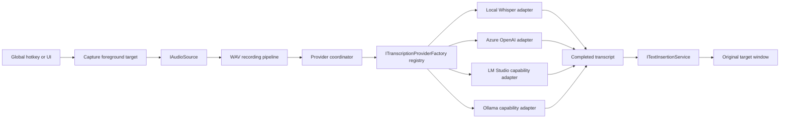

# Architecture

## Projects

- `TalkToMe.Core`: platform-independent contracts, state transitions, recording/transcription/insertion models, and settings models.
- `TalkToMe.Infrastructure`: NAudio sources and WAV writer; provider registry/coordinator; Local Whisper, Azure, LM Studio, and Ollama adapters; Win32 adapters; namespaced DPAPI; and JSON persistence.
- `TalkToMe.App`: WPF composition, windows, view models, hotkey message routing, single-instance lifecycle, and tray integration.
- `TalkToMe.UiDriver`: FlaUI UIA3 functional driver and redacted evidence capture.
- `TalkToMe.TestTarget`: isolated standard WPF Edit target for unattended insertion validation.

## Runtime Flow

The file-backed diagnostic source emits the same 16 kHz, 16-bit, mono PCM frames as the microphone boundary. `TranscriptionProviderCoordinator` serializes replacement and transcription, caches the selected engine, and reloads it only after settings save and outside active transcription. There is no fallback chain.

## State and Failure Policy

`ApplicationStateController` rejects transitions not declared in its transition table. PCM audio is flushed durably while recording under `%LOCALAPPDATA%\TalkToMe\Pending`. On startup, TalkToMe repairs an interrupted WAV header and offers the newest recoverable recording for retry or deletion. Target window metadata is stored beside the audio and reused only while the same HWND/PID remains valid. Audio is deleted after successful insertion. Azure requests are not automatically retried after ambiguous outcomes.
