# Architecture

## Projects

- `TalkToMe.Core`: platform-independent contracts, state transitions, recording/transcription/insertion models, and settings models.
- `TalkToMe.Infrastructure`: NAudio sources and WAV writer, Azure REST provider, Win32 target/hotkey/input adapters, clipboard insertion, DPAPI, and JSON persistence.
- `TalkToMe.App`: WPF composition, windows, view models, hotkey message routing, single-instance lifecycle, and tray integration.
- `TalkToMe.UiDriver`: FlaUI UIA3 functional driver and redacted evidence capture.
- `TalkToMe.TestTarget`: isolated standard WPF Edit target for unattended insertion validation.

## Runtime Flow

```mermaid
flowchart LR
    Trigger[Global hotkey or UI] --> Target[Capture foreground target]
    Target --> Source[IAudioSource]
    Source --> Recorder[WAV recording pipeline]
    Recorder --> Provider[ITranscriptionProvider]
    Provider --> Review[Completed transcript]
    Review --> Insert[ITextInsertionService]
    Insert --> Original[Original target window]
```

The file-backed diagnostic source emits the same 16 kHz, 16-bit, mono PCM frames as the microphone boundary. Diagnostic transcription is available only through an explicit command-line flag and still requires a finalized recording.

## State and Failure Policy

`ApplicationStateController` rejects transitions not declared in its transition table. Audio remains under `%LOCALAPPDATA%\TalkToMe\Pending` after transcription/insertion failure and is deleted after successful insertion. Azure requests are not automatically retried after ambiguous outcomes.
